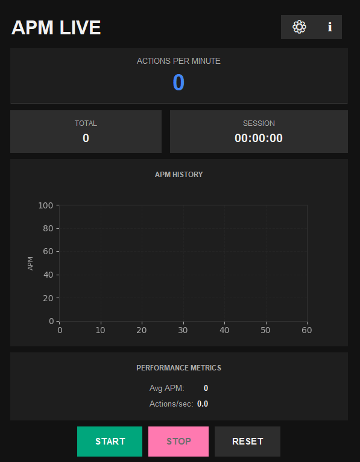

# APMLive 🇫🇷 | 🇬🇧

[English version below | Version anglaise ci-dessous]

## 🇫🇷 Français

Un calculateur d'APM (Actions Per Minute) moderne et élégant pour les joueurs de jeux vidéo, streamers et créateurs de contenu.

### 🌟 Fonctionnalités

- Interface moderne et intuitive
- Calcul en temps réel des APM
- Statistiques détaillées :
  - APM actuel
  - APM moyen
  - Actions par seconde
  - Temps de session
  - Total des actions
- Export des données en format texte et JSON
- Compatible avec OBS pour le streaming
- Sauvegarde automatique des données
- Installation facile via installateur Windows

### 📋 Prérequis

- Windows 10 ou supérieur
- Python 3.8+ (pour le développement uniquement)

### 🚀 Installation

#### Pour les utilisateurs

1. Téléchargez la dernière version de l'installateur depuis la section [Releases](https://github.com/votre-username/apmlive/releases)
2. Exécutez `APMLive_Setup.exe`
3. Suivez les instructions d'installation
4. Lancez APMLive depuis le menu démarrer ou le bureau

### 📊 Utilisation

1. Lancez l'application
2. Cliquez sur "START" pour commencer l'enregistrement
3. Jouez normalement à votre jeu
4. Les statistiques se mettront à jour en temps réel
5. Cliquez sur "STOP" pour arrêter l'enregistrement
6. Les données sont automatiquement sauvegardées dans `%LOCALAPPDATA%\APMLive`

### 🔧 Configuration

Les données sont sauvegardées dans :
- `%LOCALAPPDATA%\APMLive\apm_data.txt` (format texte)
- `%LOCALAPPDATA%\APMLive\apm_data.json` (format JSON)

### 🤝 Contribution

Les contributions sont les bienvenues ! N'hésitez pas à :
1. Fork le projet
2. Créer une branche pour votre fonctionnalité
3. Commiter vos changements
4. Pousser vers la branche
5. Ouvrir une Pull Request

### 📝 Licence

Ce projet est sous licence MIT. Voir le fichier [LICENSE](LICENSE) pour plus de détails.

---

## 🇬🇧 English

A modern and elegant APM (Actions Per Minute) calculator for video game players, streamers, and content creators.

### 🌟 Features

- Modern and intuitive interface
- Real-time APM calculation
- Detailed statistics:
  - Current APM
  - Average APM
  - Actions per second
  - Session time
  - Total actions
- Data export in text and JSON formats
- OBS compatibility for streaming
- Automatic data saving
- Easy installation via Windows installer

### 📋 Requirements

- Windows 10 or higher
- Python 3.8+ (for development only)

### 🚀 Installation

#### For Users

1. Download the latest installer version from the [Releases](https://github.com/votre-username/apmlive/releases) section
2. Run `APMLive_Setup.exe`
3. Follow the installation instructions
4. Launch APMLive from the start menu or desktop

### 📊 Usage

1. Launch the application
2. Click "START" to begin recording
3. Play your game normally
4. Statistics will update in real-time
5. Click "STOP" to stop recording
6. Data is automatically saved in `%LOCALAPPDATA%\APMLive`

### 🔧 Configuration

Data is saved in:
- `%LOCALAPPDATA%\APMLive\apm_data.txt` (text format)
- `%LOCALAPPDATA%\APMLive\apm_data.json` (JSON format)

### 🤝 Contributing

Contributions are welcome! Feel free to:
1. Fork the project
2. Create a branch for your feature
3. Commit your changes
4. Push to the branch
5. Open a Pull Request

### 📝 License

This project is licensed under the MIT License. See the [LICENSE](LICENSE) file for details.

⭐ Don't forget to star the project if you like it! 